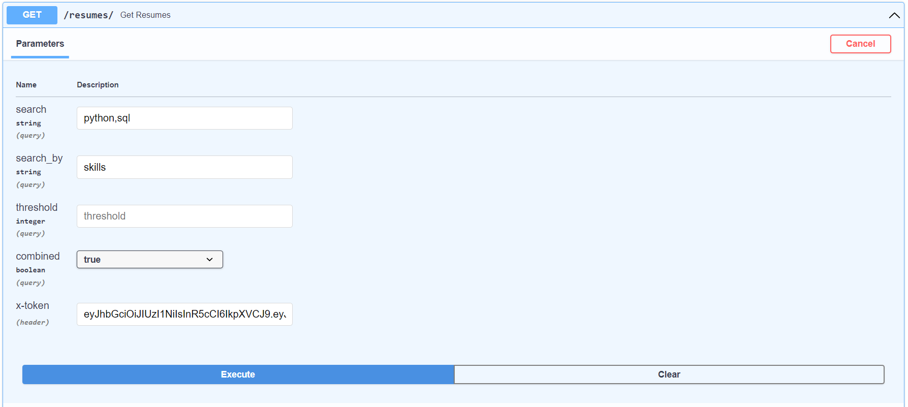
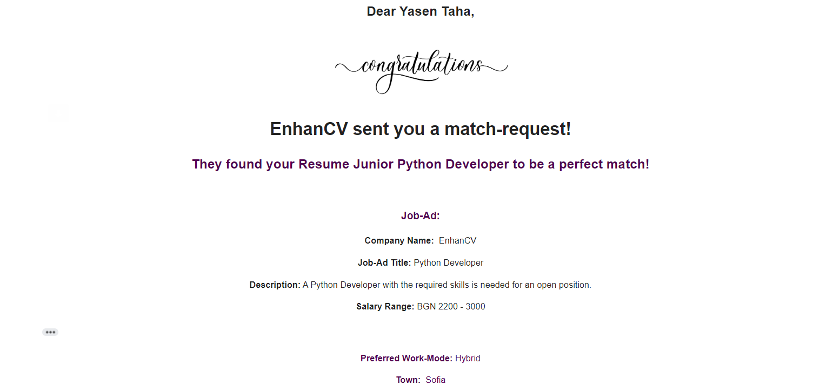

<div align="center">

<h1>JomBatch</h1>

  
<p>
    From JomBatch to Job-Match! 
</p>

<p>
  <a href="https://gitlab.com/web-project-team-2/job-match-system-api/-/graphs/developer">
    
  </a>
  <a href="https://gitlab.com/web-project-team-2/job-match-system-api/-/issues">
    
  </a>
  <a href="https://gitlab.com/web-project-team-2/job-match-system-api/-/commits/developer">
    
  </a>

</p>
</div>

<br/>


# Table of Contents

- [About the Project](#about-the-project)
  * [Summary](#summary)
  * [Team](#team)
  * [Technologies](#technologies)
  * [Database](#database)
  * [Application Structure](#application-structure)
- [Getting Started](#getting-started)
  * [Prerequisites](#prerequisites)
  * [Executing](#executing)
- [Usage](#getting-started)
  * [FastAPI Swagger](#fastapi-swagger-docs)
  * [Features](#features)
  * [Room For Improvement](#room-for-improvement)
- [Get In Touch](#get-in-touch)


<br/>

# About the Project
## Summary
Welcome to JomBatch* - From JomBatch to Job-Match!

This project contains a RESTful API that covers the main functionality behind a job-matching software over the web. 

Basically, two types of users can access the public part and register or login - companies and professionals. Based on their role, they have access to different endpoints:
- Companies can post job-ads, search for professionals or their resumes and initiate match requests
- Professionals can post resumes, search for companies or their job ads and initiate match requests
- Both can accept or reject match requests or get instant matches (like tinder).

> **The name comes from the bulgarian word **jumbish** - slang for spectacle, show (in a chaotic way).*

<br/>

## Team
- [Dimitar Vasilev](https://gitlab.com/DimitarVasilev) - responsible for Company and Job-Ad endpoints and functionality
- [Krasimir Bozhilov](https://gitlab.com/Krasimir-Bozhilov) - responsible for Professional and Resume endpoints and functionality
- [Yasen Taha](https://gitlab.com/yasentaha) - responsible for User endpoints and functionality, third-party API integration and overseeing the project implementation

<br/>

## Technologies
Language: <a href="https://www.python.org/">Python</a>
<br/>
Framework: <a href="https://www.python.org/">Fastapi</a>
<br/>
<br/>

## Database
Relational Database: <a href="https://mariadb.org/">MariaDB</a>
<br/>
RDMS: <a href="https://www.mysql.com/">MySQL</a>
<br/>

### Database Screenshot:
<div align="center">

</div>
</br>

## Application Structure
For this project, the use of the multi-tier (n-tier) atchitecture was chosen, where data access, business logic and application layer are separated into the following modules:
- data - containing the connection to the MariaDB server and models for which the FastAPI pydantic library is imported
- services - all of the functionality that operates on the database and creates the above mentioned models
- routers - defining all of the endpoints of our application

</br>
</br>

# Getting Started

## Prerequisites
This project uses pip as package manager:

```
py -m ensurepip --upgrade
```
</br>

The following packages need to be installed before running:

**FastAPI**
```
pip install fastapi
```
</br>

**MariaDB**
```
pip install mariadb
```
</br>

**PyJWT** - PyJWT - Log-in info is token-based
```
pip install python-jose[cryptography]
```
</br>

**MailJet** - Third-party API for sending email notifications
```
pip install mailjet-rest
```
</br>

**Regex**
```
pip install regex
```
</br>

**Clone the project**
```bash
git clone https://gitlab.com/web-project-team-2/job-match-system-api.git
```
</br>

## Executing
Go to the main file and type to run:
```py
uvicorn main:app
```
</br>

# Usage

## FastAPI Swagger (/docs)
After running, if message ***Application startup complete*** appears, you can follow this **[link](http://127.0.0.1:8000/docs)** and test the functionality of the app.

This should appear:


</br>

## Features
### Searching
- for Companies by name and town name
- for Professionals by name and town name
- for Resumes and Job-Ads by salary range - you can add a threshold and the salary range will be from minus the threshold to plus the threshold
- for Resumes and Job-Ads by location where you will get results for all On-site documents plus the ones that are Remote and Hybrid
- for Resumes and Job-Ads by skills/requirements where it can be a non-combined or combined search; let's say you want to search for the skills "Python" and "SQL" and the first will return Resumes/Job-Ads with either or both and the second only having both
- for Resumes by a Job-Ad where it will look for skill-matching, preffered work-place and all salary-range within the limits of the Job-Ad
- for Job-Ads by a Resume - pretty much the same as above, but it will not put an upper limit for the salary range (no employee will be mad if they pay them more than they want)

Here's what the search by skills, combined looks like:

Endpoint:
http://127.0.0.1:8000/resumes/?search_by=skills&search=python,sql&combined=true
(however, better to use the above linked swagger)

Request:


Response:


All searches will respond with collections of JSON objects of Professionals/Companies/Resumes/Job-Ads, except the ones that will return no results - status 404 and a message.

</br>

### Matching
- both Professionals and Companies can initiate match-requests - to do so a Company needs to have a Job-Ad that will request a match for a specific Resume of a Professional (and vice-versa)
- both Professionals and Companies can view their match-requests (the ones sent to them)
- both Professionals and Companies can accept and reject match-requests - the people sending these requests will receive email notifications for both cases; see below screenshot of a an email notification
- Tinder-like; let's say a Company sends a match-request to a Professional between a specific Job-Ad and Resume; if the Professional sends a request to a Company between the very same Resume and Job-Ad, then it is an instant match!

</br>
Email Notification:

</br>

## Room for improvement
- there are no pagination options so far for any of the searches and sorting only when viewing Professionals and Companies
- if a Professional accepts a match-request he must automatically reject all the other ones waiting for her/him
- a pool of skills with their ids needs to be present so that people can choose from them and not input strings manually, but this is for presentation purposes
- so far, the DB works only with Cities in Bulgaria so this can be expanded to all countires and all their towns


</br>


# Get In Touch
You can to send email to any of us from the team - Dimitar, Krasimir, Yasen or use our "company" one at jombatch@gmail.com.

Thank you for your interest in our humble project!


